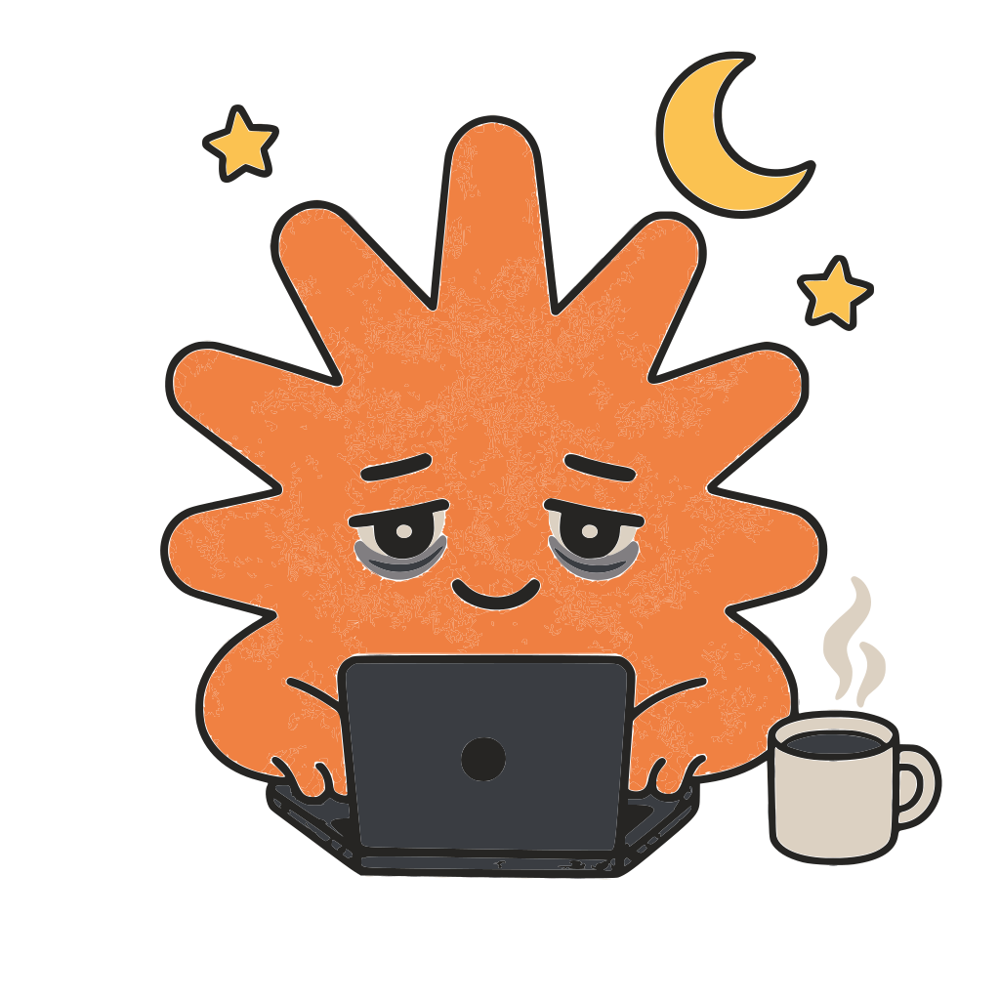
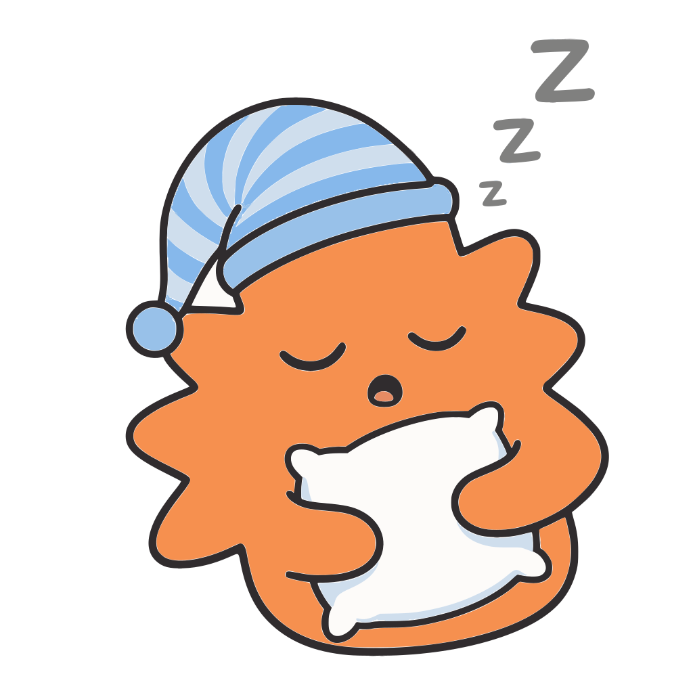
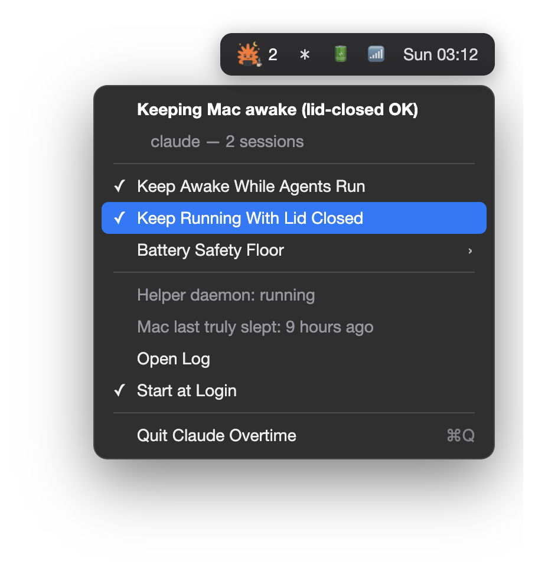

<p align="center">
  
  
</p>

<h1 align="center">Claude Overtime</h1>

<p align="center"><b>Close the lid. Claude keeps working.</b></p>

<p align="center">
  <a href="https://github.com/Yassin-Younis/claude-overtime/releases"></a>
  <a href="LICENSE"></a>
  
  <a href="https://github.com/Yassin-Younis/claude-overtime/stargazers"></a>
</p>

A macOS menu bar app that keeps your Mac awake while agentic coding CLIs
(Claude Code, Codex, Gemini CLI, and friends) are running — even with the
lid closed — and restores normal sleep the moment the last agent exits.

No more coming back to a MacBook that went to sleep mid-task and killed a
long agent run. Claude clocks in for the night shift; you go to bed.

<p align="center">
  
</p>

## Install

**Homebrew** (Apple Silicon, prebuilt):

```sh
brew install --cask yassin-younis/tap/claude-overtime
```

Then launch it once from /Applications — right-click → Open (the prebuilt
app is ad-hoc signed, so macOS warns on first open).

**From source** (any Mac; requires Xcode Command Line Tools,
`xcode-select --install`):

```sh
git clone https://github.com/Yassin-Younis/claude-overtime.git
cd claude-overtime
bash build.sh
```

That's it — the orange mascot appears in your menu bar. The first time
lid-closed support is needed, the app asks for your admin password through
the standard macOS dialog and installs its helper automatically.

You can also grab `ClaudeOvertime.app.zip` straight from
[Releases](https://github.com/Yassin-Younis/claude-overtime/releases)
(Apple Silicon) — same right-click → Open note applies.

## How it works

Claude Overtime is two small parts with a deliberate split of privileges:

**1. The menu bar app** (no root)
- Polls every 5 seconds for known agent processes by executable name.
- While at least one is running, it holds a standard IOKit power assertion
  (`PreventUserIdleSystemSleep`) — the same mechanism `caffeinate` uses.
  This stops idle sleep. The display still turns off and locks as usual;
  only system sleep is blocked.
- Shows the mascot in the menu bar: **working overtime** while it's keeping
  the Mac awake (with a session count), **asleep** when idle.

**2. The root helper** (LaunchDaemon, self-installed on demand)
- macOS has no native way to keep a MacBook running with the lid closed and
  no external display — Apple's clamshell mode requires display + power +
  keyboard. The only mechanism Apple provides is the root-only
  `pmset disablesleep`, which is why every app in this space ships a
  privileged helper.
- The helper reads the same config file the app writes (values are
  grep-parsed, never executed) and toggles `pmset -a disablesleep 1/0`
  based on: agents running? lid-closed enabled? battery above the safety
  floor?
- If it's ever stopped or uninstalled it resets `disablesleep 0` on the
  way out. `sudo pmset -a disablesleep 0` is always the manual escape
  hatch.

## Using it

Click the mascot in the menu bar:

- **Status header** — what's happening right now, plus every detected
  harness with its session count (e.g. "claude — 6 sessions").
- **Keep Awake While Agents Run** — master switch.
- **Keep Running With Lid Closed** — clamshell mode. Installs the helper on
  first use (one admin-password prompt, ever).
- **Battery Safety Floor** — on battery, at or below this percentage the
  helper lets the Mac sleep even mid-run, so a lid-closed session can't
  drain you to zero. Default 10%.
- **Mac last truly slept** — kernel ground truth, so you can verify a
  lid-closed run really stayed awake (the lock screen on reopen looks
  identical to waking from sleep — this line is how you tell the
  difference).
- **Open Log / Start at Login / Quit**

Quick terminal check: `bash status.sh`.

⚠️ A lid-closed MacBook dissipates heat through the case. On a desk that's
fine; don't run lid-closed sessions in a bag.

## Supported harnesses

Despite the name, every major agentic CLI is detected out of the box:

| Process | Tool |
|---|---|
| `claude` | Claude Code |
| `codex` | OpenAI Codex CLI |
| `gemini` | Gemini CLI |
| `copilot` | GitHub Copilot CLI |
| `cursor-agent` | Cursor CLI |
| `amp` | Sourcegraph Amp |
| `aider` | Aider |
| `goose` | Block Goose |
| `opencode` | OpenCode |
| `crush` | Charm Crush |
| `qwen` | Qwen Code |
| `droid` | Factory Droid |
| `auggie` | Augment CLI |

Add or replace names in `~/.config/claude-overtime.conf`:

```sh
EXTRA_AGENTS="myagent otheragent"   # append to the default list
AGENTS="claude codex"               # or replace it entirely
```

Both the app and the helper pick changes up within seconds. Find a tool's
process name with `ps -axo comm | grep -i <tool>` while it runs. Note that
IDE-embedded agents (VS Code extensions, etc.) run inside their editor's
process and can't be detected by name.

## Config reference (`~/.config/claude-overtime.conf`)

| Key | Default | Meaning |
|---|---|---|
| `ENABLED` | `1` | Master switch |
| `LID_CLOSED` | `1` | Allow lid-closed running (needs helper) |
| `BATTERY_FLOOR` | `10` | On battery, sleep at/below this % (0 = off) |
| `AGENTS` | built-in list | Replace the watched process list |
| `EXTRA_AGENTS` | empty | Append to the watched process list |

## Uninstall

```sh
sudo bash uninstall.sh
```

Removes everything and resets sleep behavior to normal.

## Troubleshooting

- **Mac still sleeps with lid closed** — click the mascot: is the helper
  running and the lid toggle on? Check you're not at/below the battery
  floor. `pmset -g | grep SleepDisabled` should show `1` while agents run.
- **"It slept!" (did it?)** — check "Mac last truly slept" in the menu.
  Lid-closed runs lock the screen, which looks identical to sleep on
  reopen.
- **A tool isn't detected** — its process name differs from its brand
  name; see Supported harnesses.
- **Helper wedged** — `sudo launchctl kickstart -k
  system/com.claudeovertime.helper`, log at `/var/log/claude-overtime.log`.

## License

MIT. Not affiliated with Anthropic — just a fan of the little starburst.
